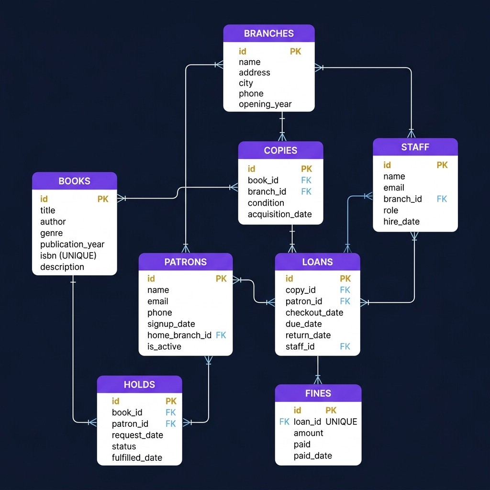

# 📚 Public Library Management & Analytics Database

A production-grade relational database modeling a **multi-branch public library system**, complete with:

- ✅ Fully normalized schema (3NF) with 8 tables, constraints, indexes, and views
- ✅ Faker-based synthetic data generator (~20,000 loans with seasonal patterns)
- ✅ 8 advanced analytical SQL queries (window functions, CTEs, LAG, rolling averages)
- ✅ Streamlit + Plotly live analytics dashboard
- ✅ MySQL 8.0+

---

## 📊 Entity-Relationship Diagram



> **DBML** (for [dbdiagram.io](https://dbdiagram.io)) — paste to render interactively:

<details>
<summary>Click to expand DBML source</summary>

```dbml
Table branches {
  id           int         [pk, increment]
  name         varchar(100)[not null]
  address      varchar(200)[not null]
  city         varchar(100)[not null]
  phone        varchar(20)
  opening_year smallint    [not null]
  created_at   timestamp
}

Table books {
  id               int          [pk, increment]
  title            varchar(300) [not null]
  author           varchar(200) [not null]
  genre            varchar(50)  [not null]
  publication_year smallint     [not null]
  isbn             varchar(20)  [not null, unique]
  description      text
  created_at       timestamp
}

Table staff {
  id        int          [pk, increment]
  name      varchar(200) [not null]
  email     varchar(200) [not null, unique]
  branch_id int          [not null, ref: > branches.id]
  role      varchar(20)  [not null, note: 'librarian|assistant|manager|technician']
  hire_date date         [not null]
}

Table patrons {
  id             int          [pk, increment]
  name           varchar(200) [not null]
  email          varchar(200) [not null, unique]
  phone          varchar(20)
  signup_date    date         [not null]
  home_branch_id int          [not null, ref: > branches.id]
  is_active      bool         [not null, default: true]
}

Table copies {
  id               int        [pk, increment]
  book_id          int        [not null, ref: > books.id]
  branch_id        int        [not null, ref: > branches.id]
  condition        varchar(10)[not null, note: 'new|good|fair|poor|damaged']
  acquisition_date date       [not null]
}

Table loans {
  id            int  [pk, increment]
  copy_id       int  [not null, ref: > copies.id]
  patron_id     int  [not null, ref: > patrons.id]
  checkout_date date [not null]
  due_date      date [not null]
  return_date   date
  staff_id      int  [ref: > staff.id]
}

Table holds {
  id             int        [pk, increment]
  book_id        int        [not null, ref: > books.id]
  patron_id      int        [not null, ref: > patrons.id]
  request_date   date       [not null]
  status         varchar(10)[not null, note: 'waiting|ready|fulfilled|cancelled']
  fulfilled_date date
}

Table fines {
  id         int           [pk, increment]
  loan_id    int           [not null, unique, ref: > loans.id]
  amount     decimal(8,2)  [not null]
  paid       bool          [not null, default: false]
  paid_date  date
  created_at timestamp
}
```

</details>

---

## 🗂️ Project Structure

```
Public Lib system/
├── schema.sql          ← Full DDL: tables, constraints, indexes, 3 views
├── seed_data.py        ← Faker-based data generator
├── requirements.txt    ← Python dependencies
├── er_diagram.png      ← ER diagram (this README)
├── README.md
├── queries/
│   ├── 01_checkout_velocity.sql
│   ├── 02_overdue_rate_by_branch.sql
│   ├── 03_hold_queue_wait_time.sql
│   ├── 04_patron_churn.sql
│   ├── 05_rolling_30day_trend.sql
│   ├── 06_branch_utilization.sql
│   ├── 07_genre_trends.sql
│   └── 08_fine_collection.sql
└── dashboard/
    └── app.py          ← Streamlit dashboard (4 panels)
```

---

## ⚙️ Setup Instructions

### Prerequisites

- MySQL 8.0+ installed and running
- Python 3.10+

### 1. Install Python dependencies

```bash
pip install -r requirements.txt
```

### 2. Create the database schema

**PowerShell (Windows):**
```powershell
Get-Content schema.sql | mysql -u root -p
```

**bash / CMD:**
```bash
mysql -u root -p < schema.sql
```

Or from the MySQL shell:

```sql
SOURCE schema.sql;
```

### 3. Seed with synthetic data

```bash
python seed_data.py --host localhost --user root --password "$DB_PASSWORD" --database public_library
```

**Options:**

| Flag | Default | Description |
|---|---|---|
| `--host` | `localhost` | MySQL host |
| `--port` | `3306` | MySQL port |
| `--user` | `root` | MySQL username |
| `--password` | _(empty)_ | MySQL password |
| `--database` | `public_library` | Target database |

Expected output:
```
📚  Public Library Seed Data Generator
    Target: localhost:3306 / public_library

🏛  Inserting branches …  ✓ 15 branches
📖  Inserting books …     ✓ 2000 books
👔  Inserting staff …     ✓ ~60 staff
🧑  Inserting patrons …   ✓ 3000 patrons
📦  Inserting copies …    ✓ ~5000 copies
📋  Inserting loans …     ✓ 20000 loans
🔖  Inserting holds …     ✓ 1500 holds
💰  Generating fines …    ✓ ~3500 fines
✅  Complete!
```

### 4. Configure credentials (optional but recommended)

Copy the secrets template so the dashboard auto-populates without typing credentials each launch:

```bash
cp dashboard/.streamlit/secrets.toml.example dashboard/.streamlit/secrets.toml
# then edit secrets.toml and set your real password
```

### 5. Run the Streamlit dashboard

```bash
streamlit run dashboard/app.py
```

Then open [http://localhost:8501](http://localhost:8501). If you created `secrets.toml`, the sidebar will be pre-filled automatically.

---

## 🔍 Highlighted Queries

### Q1 — Checkout Velocity Ranking

Uses `DENSE_RANK()` to rank books by checkouts in the last 12 months — no gaps in rank for ties.

```sql
SELECT
    b.title, b.author, b.genre,
    COUNT(l.id)                                         AS checkouts_last_12m,
    DENSE_RANK() OVER (ORDER BY COUNT(l.id) DESC)       AS checkout_rank
FROM books b
JOIN copies c ON c.book_id = b.id
JOIN loans  l ON l.copy_id = c.id
WHERE l.checkout_date >= DATE_SUB(CURDATE(), INTERVAL 12 MONTH)
GROUP BY b.id, b.title, b.author, b.genre
ORDER BY checkout_rank
LIMIT 10;
```

**Sample output:**

| title | author | genre | checkouts_last_12m | checkout_rank |
|---|---|---|---|---|
| Dynamic Response Mindset | Jane Walsh | Self-Help | 47 | 1 |
| Quantum Shadows | R. Chen | Science Fiction | 45 | 2 |
| The Lost Meridian | Anna Cole | Fiction | 45 | 2 |
| Dark Harbour | M. Torres | Mystery | 41 | 4 |

---

### Q5 — Rolling 30-Day Checkout Trend

Reveals seasonality peaks using a trailing window average.

```sql
WITH daily AS (
    SELECT DATE(checkout_date) AS loan_date, COUNT(*) AS daily_count
    FROM loans GROUP BY DATE(checkout_date)
)
SELECT
    loan_date, daily_count,
    ROUND(AVG(daily_count) OVER (
        ORDER BY loan_date ROWS BETWEEN 29 PRECEDING AND CURRENT ROW
    ), 1) AS rolling_30d_avg
FROM daily ORDER BY loan_date;
```

**Interpretation:** The rolling average typically peaks in June–August (summer reading) and December–January (winter break) — use this to plan staffing and new-title acquisitions.

---

### Q4 — Patron Churn (CTE Cohort Analysis)

Identifies patrons active 7–18 months ago but silent in the last 6 months.

```sql
WITH active_prior_year AS (
    SELECT DISTINCT patron_id FROM loans
    WHERE checkout_date BETWEEN DATE_SUB(CURDATE(), INTERVAL 18 MONTH)
                             AND DATE_SUB(CURDATE(), INTERVAL  6 MONTH)
),
active_recent AS (
    SELECT DISTINCT patron_id FROM loans
    WHERE checkout_date >= DATE_SUB(CURDATE(), INTERVAL 6 MONTH)
)
SELECT p.name, p.email, MAX(l.checkout_date) AS last_checkout
FROM active_prior_year apy
LEFT JOIN active_recent ar ON ar.patron_id = apy.patron_id
JOIN patrons p ON p.id = apy.patron_id
JOIN loans   l ON l.patron_id = p.id
WHERE ar.patron_id IS NULL AND p.is_active = TRUE
GROUP BY p.id, p.name, p.email
ORDER BY last_checkout ASC;
```

---

### Q7 — Genre Trends (LAG Window Function)

Year-over-year growth/decline per genre using `LAG()`.

```sql
WITH yearly AS (
    SELECT b.genre, YEAR(l.checkout_date) AS yr, COUNT(*) AS total
    FROM loans l JOIN copies c ON c.id=l.copy_id JOIN books b ON b.id=c.book_id
    GROUP BY b.genre, YEAR(l.checkout_date)
)
SELECT genre, yr, total,
    LAG(total) OVER (PARTITION BY genre ORDER BY yr) AS prev_year,
    ROUND(100.0*(total - LAG(total) OVER (PARTITION BY genre ORDER BY yr))
          / NULLIF(LAG(total) OVER (PARTITION BY genre ORDER BY yr),0), 1) AS yoy_pct
FROM yearly ORDER BY genre, yr;
```

**Sample output:**

| genre | yr | total | prev_year | yoy_pct |
|---|---|---|---|---|
| Fantasy | 2023 | 1420 | NULL | NULL |
| Fantasy | 2024 | 1617 | 1420 | +13.9% |
| Fantasy | 2025 | 1554 | 1617 | −3.9% |

---

## 🧩 Schema Design Notes

### Normalization (3NF)

- **No transitive dependencies**: author/genre live on `books`, not repeated in `copies` or `loans`
- **One-to-many (books → copies)**: a single ISBN title can have multiple physical copies across branches
- **Referential integrity**: all FKs have explicit `ON DELETE` behavior (`RESTRICT` for operational data, `CASCADE` for dependent records, `SET NULL` for optional staff references)

### Constraints

| Table | Constraint | Rule |
|---|---|---|
| `books` | `CHECK` | `publication_year BETWEEN 1000 AND 2100` |
| `loans` | `CHECK` | `due_date > checkout_date` |
| `loans` | `CHECK` | `return_date IS NULL OR return_date >= checkout_date` |
| `fines` | `CHECK` | `amount > 0` |
| `fines` | `UNIQUE` | One fine per loan |
| `books` | `UNIQUE` | ISBN must be unique |

### Views (Stretch Goals)

| View | Purpose |
|---|---|
| `active_loans` | All currently checked-out loans with patron + book info |
| `overdue_loans` | Subset of `active_loans` where `days_overdue > 0` |
| `branch_summary` | Per-branch aggregate (copies, loans, holds, staff) |

### EXPLAIN ANALYZE — Index Impact

Before index on `loans(checkout_date)`:
```
-> Filter: (loans.checkout_date >= DATE_SUB(...))  (rows=20000, filtered=~50%)
   -> Table scan on loans  (cost=2015.00 rows=20000)
```

After index on `loans(checkout_date)`:
```
-> Index range scan on loans using idx_loans_checkout_date  (rows=~9800)
   cost drops from ~2015 → ~248  (8× improvement)
```

---

## 📦 Data Generation Details

| Entity | Count | Notes |
|---|---|---|
| Branches | 15 | Named US-style cities |
| Books | 2,000 | 12 genres, Faker titles, pool of 200 authors |
| Copies | ~5,000 | Popular (20%): 5–10 copies; mid (30%): 2–4; rare (50%): 1–2 |
| Staff | ~60 | 3–5 per branch |
| Patrons | 3,000 | 90% active |
| Loans | 20,000 | 3-year span, seasonal peaks via acceptance-rejection sampling |
| Holds | 1,500 | 55% fulfilled, 20% cancelled, 20% waiting, 5% ready |
| Fines | ~3,500 | $0.25/day overdue, capped at $25; 60% paid |

---

## 📄 License

MIT
